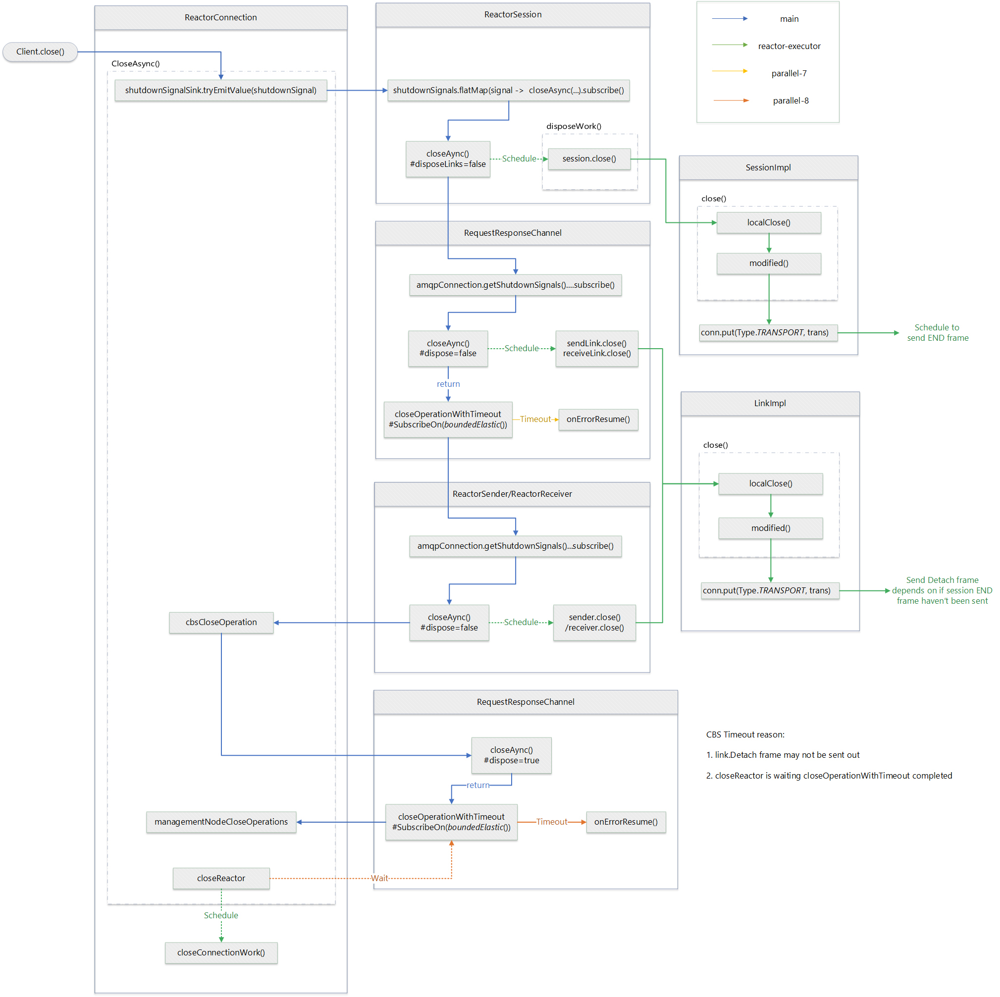

# Only emit AMQP channels downstream when they are active #24582

## Issue

https://github.com/Azure/azure-sdk-for-java/issues/24582

**Behavior**

When the CBS node (ClaimsBasedSecurityNode) is closed, it'll make a request upstream for a new channel(RequestResponseChannel). This channel is immediately emitted. As connection is inactive, it is closed then and request a upstream again. The CBS node constantly retry process cause mass of logs.

**Related issue or changes**

- Message receiving is stuck because AMQP connection is closed without an error

    https://github.com/Azure/azure-sdk-for-java/issues/22533

    https://github.com/Azure/azure-sdk-for-java/pull/22534

- Add timeout to cleaning up sender/receiver links
https://github.com/Azure/azure-sdk-for-java/pull/23381


**

### Logs

[Client closing logs](./logs.md)

We can define 5 phases for the closing logs:

1. Connection start to close
2. CBS node start to close
3. CBS node close timeout exception
4. CBS node constantly retry logs 
5. ReactorExecutor closed

### Call graph 

**CBS node start to close and timeout exception**


**CBS node constantly retry and ReactorExecutor closed**


## Analysis issues

### Issue 1: Two threads are created to close CBS node

**Reason**

We manually try to close an closed CBS node twice. and both got timeout.

First time: 
```Java
...
//RequestResponseChannel
this.subscriptions = Disposables.composite(
    ...
    amqpConnection.getShutdownSignals().next().flatMap(signal -> {
        logger.verbose("Shutdown signal received.");
        return closeAsync();
    }).subscribe()
);
```
Second time: 

```Java
//ReactorConnection
final Mono<Void> cbsCloseOperation;
if (cbsChannelProcessor != null) {
    cbsCloseOperation = cbsChannelProcessor.flatMap(channel -> channel.closeAsync());
} else {
    cbsCloseOperation = Mono.empty();
}
```

These two manually calls both encounter the timeout exceptions and create a new thread to resume.

### Issue 2: CBS node close timeout exception

#### Reason

`RequestResponseChannel` sender and receiver links haven't sent the `Link:Detach` frame. And the `onRemoveLinkClosed` in link handlers haven't been triggered to emit complete closing signal to end the `cbsClosingWithTimeout`. 

Why `Link:Detach` frame haven't been sent? 

Because `ReactorSession` is closed ealier than `RequestResponseChannel` and Session:END frame will override the sending of `Link:Detach` frame. So when `channel` is ready to send `Session:END` and `Link:Detach` are not be scheduled to send, we will met this timeout issue. 

When we use the debug mode, sometimes there is no timeout issue. This is because `channel` is ready until both `Session:END` and `Link:Detach` have been scheduled to send. In this case, `channel` will send `Link:Detach` first and then `Session:END` frame. 


#### Detail logic 

When `ReactorConnection#closeAync()` is called, it will do following steps:
1. Emit connection shutdown signal, and notify all closing subscribers:
    - `ReactorSession` close all sessions on the connection
    - `RequestResponseChannel` close cbs channel/managment channels.
    - `ReactorSender` / `ReactorReceiver` close sender/receiver links.

2. Close CBS node by `cbsCloseOperation`.

3. Close management nodes by `managementNodeCloseOperation`.

4. Close connection by `closeReator`.



**Q: Why Timeout Exeception?**

`closeMono` complete signal will close the timeout. And `closeMono` is completed after cbs link handlers are completed. 

```Java
//RequestResponseChannel
final Mono<Void> closeOperationWithTimeout = closeMono.asMono()
        .timeout(retryOptions.getTryTimeout())
        .onErrorResume(TimeoutException.class, error -> {
                ...
            });
        })
        .subscribeOn(Schedulers.boundedElastic());
```

And `closeReactor` will block to wait `cbsCloseOperation` completed. 

```Java
//ReactorConnection
Mono<Void> closeAsync(AmqpShutdownSignal shutdownSignal) {
    ...
    final Sinks.EmitResult result = shutdownSignalSink.tryEmitValue(shutdownSignal);
    ...
    final Mono<Void> cbsCloseOperation;
    if (cbsChannelProcessor != null) {
        cbsCloseOperation = cbsChannelProcessor.flatMap(channel -> channel.closeAsync());
    }
    ...
    final Mono<Void> managementNodeCloseOperations = Mono.when(
        Flux.fromStream(managementNodes.values().stream()).flatMap(node -> node.closeAsync()));

    final Mono<Void> closeReactor = Mono.fromRunnable(() -> {
        ...
                dispatcher.invoke(() -> closeConnectionWork());
        ...
    });
    return Mono.whenDelayError(
        cbsCloseOperation.doFinally(signalType ->
        ...
        managementNodeCloseOperations.doFinally(signalType ->
        ...
        .then(closeReactor.doFinally(signalType ->
        .then(isClosedMono.asMono());
}
```
If no Detach frame is sent out, the cbs link handler wouldn't received remote detach frame ant the `onLinkRemoteClose` wouldn't be fired. So links complete signal wouldn't emit to `closeMono`.

```Java
//LinkHanlder
public void onLinkRemoteClose(Event event) {
    handleRemoteLinkClosed("onLinkRemoteClose", event);
}

private void handleRemoteLinkClosed(final String eventName, final Event event) {
    ...
    if (condition != null && condition.getCondition() != null) {
        ...
    } else {
        super.close(); //emit close and complete signal
    }
```

**Q: Why CBS node couldn't send out the Detach frame?**

In Proton-J, when a enpoint (connection, session, link) is closed, it would firstly set endpoint state to close and then schedule a transport task to send out Close/End/Detach frame. 

```Java
//EndpointImpl
@Override
public void close()
{
    if (getLocalState() != EndpointState.CLOSED)
    {
        _localState = EndpointState.CLOSED;
        localClose();
        modified();
    }
}

void modified(boolean emit)
{
    ...
    if (emit) {
        ...
        if (trans != null) {
            conn.put(Event.Type.TRANSPORT, trans);
        }
    }
}
```
When session is closing, it will send the END frame by `Transport`. 

```Java
//TransportImpl
private void processEnd()
{
    ...
    if((endpoint instanceof SessionImpl)) {
            ...
            int channel = freeLocalChannel(transportSession);
            End end = new End();
            ...
            writeFrame(channel, end, null, null);
        }

        endpoint.clearModified();
    }
    ...
}
```
Inside `freeLocalChannel`, it will remove `handle` for links. So that links on that session would sent out Detach as `transportLink.isLocalHandleSet()` is false.

```Java
//TransportImpl
private void processDetach()
...
    if(endpoint instanceof LinkImpl)
    {

        if(...
            && transportLink.isLocalHandleSet()
            && transportSession.isLocalChannelSet())
        {
            Detach detach = new Detach();
            detach.setHandle(localHandle);
            detach.setClosed(!link.detached());
            ...
            writeFrame(transportSession.getLocalChannel(), detach, null, null);
        }
        endpoint.clearModified();
    }
...
```

In our current code logic, `session.close()` is called earlier than `link.close()`. So the detach frame wouldn't be sent out.

**Q: Why sometimes Detach frame can be sent in debug mode?**

As we schedule to transport session:End and link:Detach frame on `reactor` thread and transport tasks should wait channel is ready to be writeable. 

If session:End haven't been sent and we schedule to send link:Detach on transport. Next time, when transport is writeable, it will first process detach task and send out detach frame. Then it will send out the End frame.    

```Java
//TransportImpl
@Override
public boolean writeInto(ByteBuffer outputBuffer)
{
    ...
    processDetach();
    processEnd();
    processClose();
    ...
}
```
In this scenario, `onLinkRemoteClose` will be triggered as we can received remote detach frame. 

#### How to fix

Timeout issue frame sequence:


**Solution 1:** Close session until we have sent and received the CBS link detach frame.

- Wrap connection `shutdownSignal` in `emitShutDownSignalOperation` and block until `cbsCloseOperation` finished.
- Add `takeUntilOther(shutdownSignalSink.asMono())` when create RRChannel
 


Side effect: CBS node will request one un-initialize cbs channel after it closed. However, it can self-close after connection shutdown signal is emiited.

**Solution 2:** Ensure CBS Detach is sent earlier than session END frame. But async received.

- Wrap connection shutdownSignal in emitShutDownSignalOperation and block until cbsCloseOperation finished.
- Change to use `cbsChannelProcessor.dispose()`


Change from 
```Java
cbsCloseOperation =  cbsChannelProcessor.flatMap(channel -> channel.closeAsync());
```
to 
```Java
cbsCloseOperation = Mono.fromRunnable(() -> cbsChannelProcessor.dispose());
```

As dispose() wouldn't return `closeOperationWithTimeout`, so `closeReactor` wouldn't wait CBS node totally completed. 

**Solution 3:** Just change cbsChannelProcessor to use dispose, since it would not block emit connection close, so that links will be close by `onLinkFinal` if no detach frame are sent out.

- Change to use `cbsChannelProcessor.dispose()`


**TODO** 

Same issue for sender/receiver links detach frame.But they don't have the no timeout issue.

## Issue 3: CBS node retry infinite loop which cause massive logs

**Reason** 

When CBS node (RequestResponseChannel) is closed, it will emit a complete signal, and that signal is catch by `connectionSubscription` which will request a new upstream `RequestResponseChannel`. 

But when new instance of `RequestResponseChannel` is created, it will be closed immediately since connection is shutdown. And that close action will emit a complete signal again and request upstream again. 

This back and forth process cause massive log in console. 


**Code Details** 

When CBS sender and receiver links are closed. It will emit a complete signal:

```Java
//RequestResponseChannel
private void onTerminalState() {
    ...
    endpointStates.emitComplete(((signalType, emitResult) -> onEmitSinkFailure(...)));
    ...
}
```

The complete signal is catched by `connectionSubscription`. Because channel status is not disposed currently and then goes to `requestUpstream()`.

```Java
//AmqpChannelProcessor
connectionSubscription = endpointStatesFunction.apply(amqpChannel).subscribe(
        ...
        () -> {
                ...
                requestUpstream();
        });
```

Because CBS channel is requested from a repeat Flux inside `createRequestResponseChannel()`, so a `RequestResponseChannel` instance is created.

```Java
//ReactorConnection
protected AmqpChannelProcessor<RequestResponseChannel> createRequestResponseChannel(
    final Flux<RequestResponseChannel> createChannel = ...
         .map(reactorSession -> new RequestResponseChannel(...))
        .doOnNext(e -> {...})
        .repeat();
```
However, inside `RequestResponseChannel` constructor, it call `closeAysc()` and schedule link close tasks, which close current channel after it created.

```Java
...
//RequestResponseChannel
this.subscriptions = Disposables.composite(
    ...
    //TODO (conniey): Do we need this if we already close the request response nodes when the
    // connection.closeWork is executed? It would be preferred to get rid of this circular dependency.
    amqpConnection.getShutdownSignals().next().flatMap(signal -> {
        logger.verbose("Shutdown signal received.");
        return closeAsync();
    }).subscribe()
);
```

As new channel is closed, it will emit a complete signal to request new upstream, which goes to the beginning step.

This is a infinite loop for CBS node.

### Test Solutions(not final solution)

1. Remove `RequestResponseChannel#amqpConnection` to avoid duplicate closing (issue 1, issue 3)

    - Only have one close thread
    - No infinite loop, but have one request upstream log

2. Explict Emit `closeMono` complete signal when first time close channel(issue 2)
   
    - No timeout issue
    

3. Not to emit channel complete signal when close/ remove requestUpStream() (issue 3)

    - No request upstream log

4. Try to use takeUntilOther(shutdown signal) after repeat (issue 3)
    - should work with step 5 
    - No request upstream log

5. Remove manually close cbs channel in ReactorConnection (issue 2)
    - No timeout issue

change logs of 1 + 2 + 3: [solution-logs-123](./solution-logs-123.md)


change log of 1 + 4 + 5: [solution-logs-145](./solution-logs-145.md)

(Current change) change log of 4 + 5: [solution-log-45](./solution-logs-45.md)


