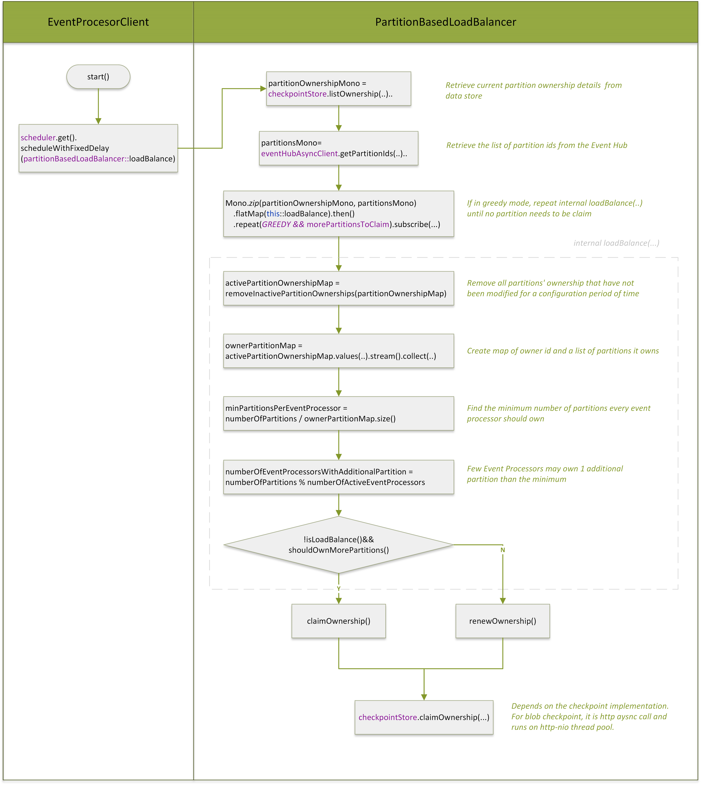

# Event Hubs Claim Ownership Encounter 412 Status Code (ConditionNotMet) Error

Open issue: https://github.com/Azure/azure-sdk-for-java/issues/31672

User see below error:
```
15:14:12.147 [reactor-http-nio-2] WARN  c.a.m.e.PartitionBasedLoadBalancer - Error while claiming checkpoints
Status code 412, "<?xml version="1.0" encoding="utf-8"?><Error><Code>ConditionNotMet</Code><Message>The condition specified using HTTP conditional header(s) is not met.
RequestId:0ead3cb5-c01e-002e-4c78-f2fae0000000
Time:2022-11-07T07:14:11.4954611Z</Message></Error>"
Error occurred while processing events Status code 412, "<?xml version="1.0" encoding="utf-8"?><Error><Code>ConditionNotMet</Code><Message>The condition specified using HTTP conditional header(s) is not met.
RequestId:0ead3cb5-c01e-002e-4c78-f2fae0000000
Time:2022-11-07T07:14:11.4954611Z</Message></Error>"
15:14:12.148 [reactor-http-nio-2] ERROR c.a.m.e.PartitionBasedLoadBalancer - Error while claiming checkpoints
15:14:12.149 [reactor-http-nio-2] ERROR reactor.core.publisher.Operators - Operator called default onErrorDropped
```

The issue can be repro on local and stress test.

The issue start from June release (`azure-messaging-eventhubs 5.12.1`, `azure-messaging-eventhubs-checkpointstore-blob 1.13.0`), the change is https://github.com/Azure/azure-sdk-for-java/pull/28467.

There is one partial rollback on Sept release (`azure-messaging-eventhubs 5.13.1`, `azure-messaging-eventhubs-checkpointstore-blob 1.15.1`), the change is https://github.com/Azure/azure-sdk-for-java/pull/30828.


### When user can see 412 status code error?

EventProcessor will periodically run `loadBalance()` to claim/renew ownership on partitions. 

If we use a blob checkpoint store, we will add request condition of `ETag` to each claim ownership request.

```Java
//BlobCheckpointStore

//New blob
blobRequestConditions.setIfNoneMatch("*");
return blobAsyncClient.getBlockBlobAsyncClient()
    .uploadWithResponse(Flux.just(UPLOAD_DATA), 0, null, metadata, null, null,blobRequestConditions)

//Update existing blob
blobRequestConditions.setIfMatch(partitionOwnership.getETag());
return blobAsyncClient.setMetadataWithResponse(metadata, blobRequestConditions)
```

When the `ETag` in the request is different from the `ETag` in the blob item, **it means that the partition is already owned by another processor** and the storage service will respond with a 412 ConditionNotMet error.

Since the 412 ConditionNotMet error is normal in load balancing, we should specifically handle the 412 status code error. To be consistent with .NET or other languages, we can just mark the ownership request as failed without throwing out the error(returning `Mono.empty()`).

### Why does the 412 error also occur when I only run one processor?

Load Balance FLow:

 

Issue Code:

```Java
//PartitionBasedLoadBalancer

Mono.zip(partitionOwnershipMono, partitionsMono)
        .publishOn(scheduler)
        .flatMap(this::loadBalance)
        .then()
        .repeat(() -> LoadBalancingStrategy.GREEDY == loadBalancingStrategy && morePartitionsToClaim.get())
        .subscribe(...);

Mono<Void> loadBalance(final Tuple2<Map<String, PartitionOwnership>, List<String>> tuple) {
    return Mono.fromRunnable(() -> {
        ...
        claimOwnership(); //Blob checkpoint is an aync call
        return;
    }
}

```
Because when use blob checkpoint, **`claimOwnership()` will invoke asynchronous calls to blob container** (`blobClient.uploadWithResponse()`,`blobClient.setMetadataWithResponse()`), just after we send out the request, internal `loadBalance()` function returns and we go to `then().repeat(...)` to invoke another `claimOwnership()` call. The blob request use netty and runs on the thread pool `reactor-http-nio`.

Hence, there will be **multiple `claimOwnership()` threads running simultaneously on a processor.** When the processor has finished parsing itself, it is possible that it will receive 412 status code errors.

Issue Log:
```
15:14:09.986 [reactor-http-nio-1] INFO  c.a.m.e.PartitionBasedLoadBalancer - Starting next iteration of load balancer
...
15:14:11.827 [reactor-http-nio-3] INFO  c.a.m.e.PartitionBasedLoadBalancer - Starting next iteration of load balancer
...
15:14:14.182 [reactor-http-nio-4] INFO  c.a.m.e.PartitionBasedLoadBalancer - Starting next iteration of load balancer
...
15:14:15.991 [reactor-http-nio-5] INFO  c.a.m.e.PartitionBasedLoadBalancer - Starting next iteration of load balancer
...
15:14:16.289 [reactor-http-nio-4] INFO  c.a.m.e.PartitionBasedLoadBalancer - {"az.sdk.message":"Successfully claimed ownership.","partitionId":"27"}
```

### Summary 

#### Two issues

1. We shouldn't throw 412 status code out of `BlobCheckpoint`.
2. The blob checkpoint `claimOwnership()` is async call, which cause multiple threads to `claimOwnership()` for one processor, we should block function until service response.


#### Rollback as a quick fix 

https://github.com/Azure/azure-sdk-for-java/pull/31947

It can't fix for issue 2, but mitigate the impact):

#### Future Solution:

Issue 1

Refer .NET error handling code:
https://github.com/Azure/azure-sdk-for-net/blob/main/sdk/eventhub/Azure.Messaging.EventHubs.Shared/src/BlobCheckpointStore/BlobCheckpointStoreInternal.cs#L247-L265

Issue 2

1. Add block for `claimOwnership()` or `renewOwnership()` in `PartitionBasedLoadBalancer`

```Java
//PartitionBasedLoadBalancer
 private void claimOwnership(final Map<String, PartitionOwnership> partitionOwnershipMap, final String partitionIdToClaim) {
    ...
    checkpointStore
        .claimOwnership(partitionsToClaim)
        .publishOn("can block thread")
        ...
        .doOnError(ex -> {})
        .doOnSuccess()
        .block();
    ...
```

Because `checkpointStore.claimOwnership` will jump to `reactor-http-nio` thread and it can't be block, here it may need to publishOn another thread to enable `block()`.

2.  `claimOwnership()` or `renewOwnership()` return `Mono` or `Flux`.

Need to consistent the return type.

```Java
//claimOwnership
 checkpointStore
            .claimOwnership(partitionsToClaim)
            ...
            .collectList()
            .zipWhen(ownershipList -> checkpointStore.listCheckpoints(...).getPartitionId(), Function.identity())); 
            
// return type Tuple2<List<PartitionOwnership>, Map<String, PartitionOwnership>>

//renewOwnership
checkpointStore.claimOwnership(...)
            .stream()
            .map(...)
            .collect(Collectors.toList())) 
//return type List<PartitionOwnership>
```

It may still need to publishOn("can block thread")

3. Use Blob sync client 

The `checkpoint.claimOwnership` return type is Flux<>.


