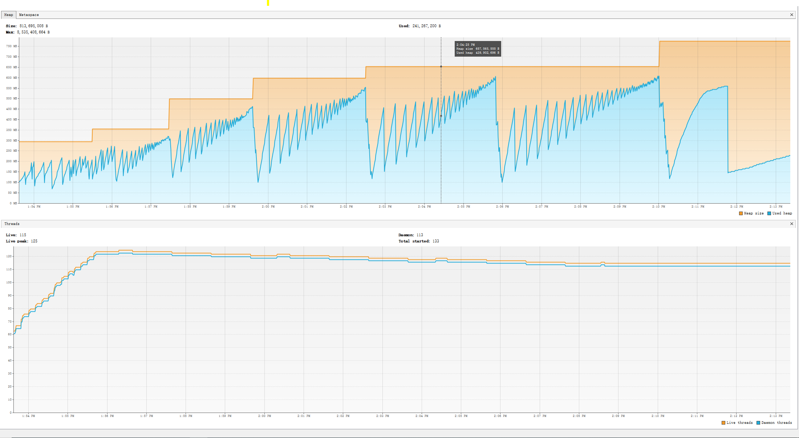
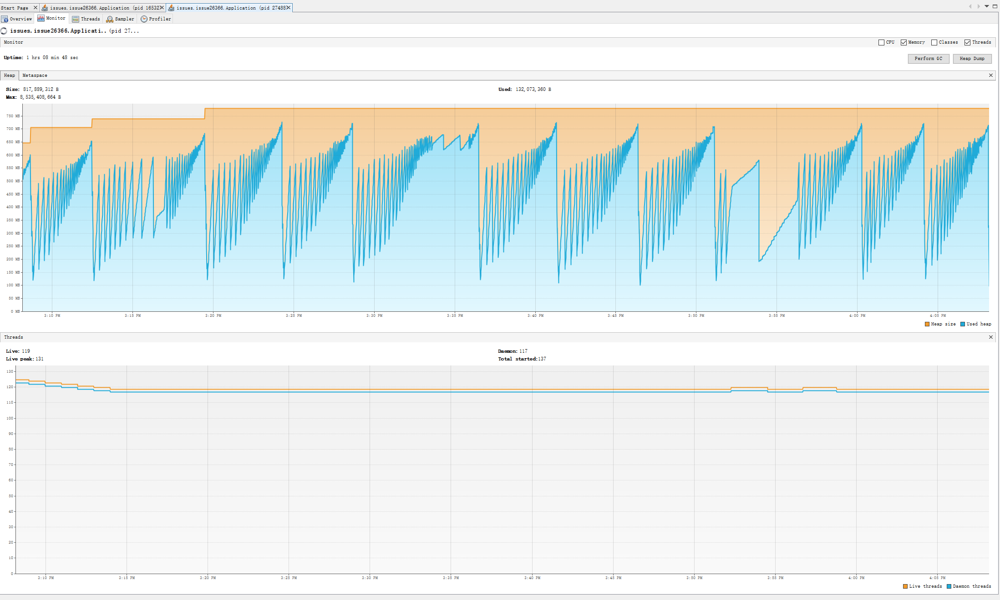
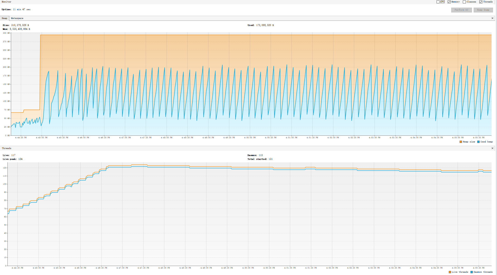

# [BUG] OutOfMemoryError only get events from Azure EventHub #26366

## Issue summary

https://github.com/Azure/azure-sdk-for-java/issues/26366

Customer is facing OOM issue after starting the spring application with `EventProcessorClient` bean. 

Customer has tried to enable/disable "timeout" for batch receive API. But both have the OOM issue. 

Details:
1. Package information
    - Java version: 16  
    - azure-messaging-eventhubs:5.10.1
    - azure-messaging-eventhubs-checkpointstore-blob:1.10.0
2. Event hub information
    - 16 partitions 
    - Both event hub and consumers are on East US
    - The average size of each event is 3.3kb and process with a batch size of 1000/2000
    - The hub keeps the application busy all time, it has usually millions of events to be delivered to the consumers
    - The max heap was set to 4GB (Xmx)

## Reproduce issue - could not reproduce now

### Test Case 1: Send one million events first and then start application to consume (No OOM issue)

1.Send enough events to event hub at first - 1000,000 events

Sender.java
```Java
public class Sender {
    private static final String connectionString ="";
    private static final String eventHubName = "";
    //Around 3.3kb
    private static final Integer dataSize = 1600;
    //To keep sufficient events in hub
    private static final Integer eventNumber = 1000000;

    //Send times configuration
    private static final Integer sendTimes = 1;
    private static final Integer sendInternal = 10 * 60 * 1000; //10 minutes

    public static void main(String[] args) throws InterruptedException {
        EventHubProducerClient producer = new EventHubClientBuilder()
                .connectionString(connectionString, eventHubName)
                .buildProducerClient();

        char[] data = new char[dataSize];
        String body = new String(data);

        List<EventData> allEvents = new ArrayList<>();
        for (int i = 0; i < eventNumber; i++) {
            allEvents.add(new EventData(body));
        }

        for(int i = 0; i < sendTimes; i++){
            sendData(producer, allEvents);
            Thread.sleep(sendInternal);
        }
        producer.close();
    }

    private static void sendData(EventHubProducerClient producer, List<EventData> allEvents){
        EventDataBatch eventDataBatch = producer.createBatch();
        for (EventData eventData : allEvents) {
            if (!eventDataBatch.tryAdd(eventData)) {
                producer.send(eventDataBatch);
                eventDataBatch = producer.createBatch();

                if (!eventDataBatch.tryAdd(eventData)) {
                    throw new IllegalArgumentException("Event is too large for an empty batch. Max size: "
                            + eventDataBatch.getMaxSizeInBytes());
                }
            }
        }
        if (eventDataBatch.getCount() > 0) {
            producer.send(eventDataBatch);
        }
    }
}
```


2.Start Spring application with `EventProcessorClient` Bean

EventHubsClientConfiguration.java
```Java
@Configuration
public class EventHubsClientConfiguration {
    private static final String eventHubconnectionString = "";
    private static final String eventHubName = "";
    private static final String storageConnectionString = "";
    private static final String storageContainer = "";

    @Bean(initMethod = "start")
    public EventProcessorClient eventOfferUpProcessorClient(){
        BlobContainerAsyncClient blobContainerAsyncClient = new BlobContainerClientBuilder()
                .connectionString(storageConnectionString)
                .containerName(storageContainer)
                .buildAsyncClient();

        return new EventProcessorClientBuilder()
                .connectionString(eventHubconnectionString, eventHubName)
                .consumerGroup(EventHubClientBuilder.DEFAULT_CONSUMER_GROUP_NAME)
                .processEventBatch(getBatchEvents(), 2000)
                .processError(getProcessError())
                .checkpointStore(new BlobCheckpointStore(blobContainerAsyncClient))
                .buildEventProcessorClient();
    }

    private Consumer<EventBatchContext> getBatchEvents(){
        return eventBatchContext -> {
            List<EventData> events = eventBatchContext.getEvents();
            eventBatchContext.updateCheckpoint();
        };
    }

    private Consumer<ErrorContext> getProcessError() {
        return errorContext -> {
            System.out.printf("Error occurred in partition processor for partition %s, %s.%n",
                    errorContext.getPartitionContext().getPartitionId(),
                    errorContext.getThrowable());
        };
    }
}
```

Application.java
```Java
@SpringBootApplication
public class Application {
	public static void main(String[] args) {
		SpringApplication.run(Application.class, args);
	}
}
```


3.Monitor Heap usage (15 minutes)




**Conclusion:** 

- It takes about 15 minutes to consume one million events. 
- The maximum heap usage only reaches 500MB. 

### Test Case 2: Send one million events every 10 minutes and keep consuming 1 hour (No OOM issue)

1.Run Sender class to send one million events every 10 minutes

Change `sendTimes` to a bigger value in Sender.java, for example:

```Java
private static final Integer sendTimes = 6;
```

2.Start Spring application with `EventProcessorClient` Bean

3.Monitor Heap Usage (1 Hour)



**Conclusion:** 

- The maximum heap usage is around 750MB and is stable after some time. 
- The trend in graph is not same as the user provided.

### Test Case 3: Process with timeout enabled (No OOM issue)

1.Send enough events to event hub at first 
2.Start Spring application with `EventProcessorClient` Bean and **timeout enabled**

Update `processEventBatch()` configuration
```Java
.processEventBatch(getBatchEvents(), 1000, Duration.of(5, ChronoUnit.SECONDS))
```

3.Monitor Heap Usage (10 minutes)



**Conclusion:**
- Heap usage looks good even for timeout feature.

## Anaylise the JFR file