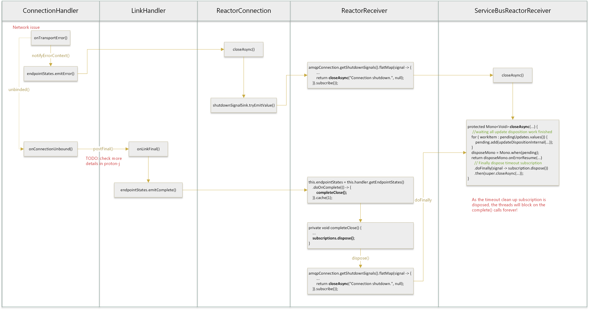

#  ServiceBusProcessorClient stop consuming messages when the network is down for a short period of time


### Issue

https://github.com/Azure/azure-sdk-for-java/issues/33493

User find if their network is down for a short period of time, some of their processing threads will block at `complete()` calls forever.

#### Repro

Use ServiceBusProcessorClient and set the maxConcurrentCalls = 10.
```Java
processorClient = new ServiceBusClientBuilder()
        .connectionString(serviceBusConnectionString)
        .processor()
        .queueName(serviceBusQueue)
        .prefetchCount(0)
        .maxConcurrentCalls(10)
        .disableAutoComplete()
        .processMessage(processMessage)
        .processError(processError)
        .buildProcessorClient();
```

In process function, we sleep 1 second to make logs more clear.

```Java
Consumer<ServiceBusReceivedMessageContext> processMessage = messageContext -> {
    try {
        System.out.printf("Thread name [%s] - received message id [%s], message sequence number [%s] " +
                        ",  message token [%s], message content [%s] \n",
                Thread.currentThread().getName(),
                messageContext.getMessage().getMessageId(),
                messageContext.getMessage().getSequenceNumber(),
                messageContext.getMessage().getLockToken(),
                messageContext.getMessage().getBody());

        TimeUnit.SECONDS.sleep(1);
        messageContext.complete();
    } catch (Exception ex) {
        messageContext.abandon();
    }
};
```

Start the client, we could see 10 threads are processing messages.
```
Thread name [boundedElastic-1] - received message id [184], message sequence number [2045147] ,  message token [f638967a-9740-42f3-9b62-caae3ac2a788], message content [Hello world] 
Thread name [boundedElastic-2] - received message id [185], message sequence number [2045148] ,  message token [babe7ed6-5dcd-429f-be11-213019228f17], message content [Hello world] 
Thread name [boundedElastic-3] - received message id [186], message sequence number [2045149] ,  message token [a3647636-9002-4581-8e02-f302bfb41b91], message content [Hello world] 
Thread name [boundedElastic-4] - received message id [187], message sequence number [2045150] ,  message token [742587f6-772e-4d38-af51-27e0d67c57bd], message content [Hello world] 
Thread name [boundedElastic-5] - received message id [227], message sequence number [2045190] ,  message token [1bcaa66e-514a-4863-bb32-f3a9a993c4bf], message content [Hello world] 
Thread name [boundedElastic-6] - received message id [228], message sequence number [2045191] ,  message token [59f7c2ed-c8bf-4908-a52f-2811ef495364], message content [Hello world] 
Thread name [boundedElastic-7] - received message id [229], message sequence number [2045192] ,  message token [a083fe3c-5a7a-47d0-aec1-62a0ccdf89cf], message content [Hello world] 
Thread name [boundedElastic-8] - received message id [230], message sequence number [2045193] ,  message token [148154ea-f33a-44bc-9daa-09fb0a8af7b8], message content [Hello world] 
Thread name [boundedElastic-9] - received message id [231], message sequence number [2045194] ,  message token [bf23690e-03df-45e6-944d-57b909bfdfea], message content [Hello world] 
Thread name [boundedElastic-10] - received message id [232], message sequence number [2045195] ,  message token [90876e96-a7ab-480a-9115-1c2f09f44d94], message content [Hello world] 
Thread name [boundedElastic-1] - received message id [233], message sequence number [2045196] ,  message token [248aba1b-1996-4c95-a080-5def55cb5bfd], message content [Hello world] 
Thread name [boundedElastic-2] - received message id [234], message sequence number [2045197] ,  message token [6c5ba088-e8e9-4712-87a6-1c55ce26668b], message content [Hello world] 
```

Disconnect the network for few seconds, and we could see the connection is recovered after the 'onTransportError', but **only 7 threads continue to process messages** (the thread number may be different for each test).

```
14:37:22.585 [reactor-executor-1] WARN  com.azure.core.amqp.implementation.handler.ConnectionHandler - {"az.sdk.message":"onTransportError","connectionId":"MF_ac03fc_1676615833511","errorCondition":"proton:io","errorDescription":"An existing connection was forcibly closed by the remote host","hostName":"xxx.servicebus.windows.net"}
...
Thread name [boundedElastic-3] - received message id [236], message sequence number [2045199] ,  message token [6f2547d9-92a6-4680-b9d1-81863199a830], message content [Hello world] 
Thread name [boundedElastic-4] - received message id [237], message sequence number [2045200] ,  message token [d60792fb-c6f1-4d49-aeaf-65bc9dcd5e11], message content [Hello world] 
Thread name [boundedElastic-5] - received message id [238], message sequence number [2045201] ,  message token [0e5a424e-ac46-444a-a7ba-da4405912c8a], message content [Hello world] 
Thread name [boundedElastic-6] - received message id [239], message sequence number [2045202] ,  message token [1ab89cd4-2d75-483e-ac1e-6704342e6af6], message content [Hello world] 
Thread name [boundedElastic-7] - received message id [240], message sequence number [2045203] ,  message token [0f3b8915-7655-4932-a1b3-bd986882bb96], message content [Hello world] 
Thread name [boundedElastic-8] - received message id [241], message sequence number [2045204] ,  message token [aa14dfaf-4bb4-4a19-90e5-9e8057df2a85], message content [Hello world] 
Thread name [boundedElastic-9] - received message id [242], message sequence number [2045205] ,  message token [4ca1a5ad-5efb-4360-ae90-3c1ee1ed60c3], message content [Hello world] 
Thread name [boundedElastic-3] - received message id [243], message sequence number [2045206] ,  message token [b63911fc-48de-438a-a7f1-91db6ed7a4b4], message content [Hello world] 
Thread name [boundedElastic-4] - received message id [244], message sequence number [2045207] ,  message token [48474465-d405-4b13-b9ee-50ba301f09a8], message content [Hello world] 
Thread name [boundedElastic-5] - received message id [245], message sequence number [2045208] ,  message token [6f74feb9-6136-4463-8f9a-ace1b91709ba], message content [Hello world] 
Thread name [boundedElastic-6] - received message id [246], message sequence number [2045209] ,  message token [56254911-d624-43c6-887f-d15b53aa9afe], message content [Hello world] 
Thread name [boundedElastic-7] - received message id [247], message sequence number [2045210] ,  message token [7d2e7f9e-c2e7-4daf-8df0-8065fb004432], message content [Hello world] 
Thread name [boundedElastic-8] - received message id [248], message sequence number [2045211] ,  message token [3965d1e6-5740-4bbb-b049-fe902050fbec], message content [Hello world] 
Thread name [boundedElastic-9] - received message id [224], message sequence number [2045187] ,  message token 
```

**The other 3 threads are blocking at complete() calls, even if we wait until the internal timeout.**
```
"boundedElastic-1@2675" daemon prio=5 tid=0x1d nid=NA waiting
  java.lang.Thread.State: WAITING
	  at jdk.internal.misc.Unsafe.park(Unsafe.java:-1)
	  at java.util.concurrent.locks.LockSupport.park(LockSupport.java:194)
	  at java.util.concurrent.locks.AbstractQueuedSynchronizer.parkAndCheckInterrupt(AbstractQueuedSynchronizer.java:885)
	  at java.util.concurrent.locks.AbstractQueuedSynchronizer.doAcquireSharedInterruptibly(AbstractQueuedSynchronizer.java:1039)
	  at java.util.concurrent.locks.AbstractQueuedSynchronizer.acquireSharedInterruptibly(AbstractQueuedSynchronizer.java:1345)
	  at java.util.concurrent.CountDownLatch.await(CountDownLatch.java:232)
	  at reactor.core.publisher.BlockingSingleSubscriber.blockingGet(BlockingSingleSubscriber.java:87)
	  at reactor.core.publisher.Mono.block(Mono.java:1707)
	  at com.azure.messaging.servicebus.ServiceBusReceivedMessageContext.complete(ServiceBusReceivedMessageContext.java:81)
```

### Reason

**_The internal timeout we set for the `complete()/abandon()` are removed when link is closed completely. So when connection is recovering, threads those are blocked in `complete()/abandon()` calls will wait forever after the old receive link is closed._**

### Code Analysis

The `complete()/abandon()` will send update disposition request to service bus with different disposition status, and we wrap these update disposition tasks as [_UpdateDispositionWorkItem_](https://github.com/Azure/azure-sdk-for-java/blob/6d827ec4869bb797a858eaed855290d5926a080a/sdk/servicebus/azure-messaging-servicebus/src/main/java/com/azure/messaging/servicebus/implementation/ServiceBusReactorReceiver.java#L431-L434) and set a timeout value for them.

```Java
//Inner class in ServiceBusReactorReceiver.class
private static final class UpdateDispositionWorkItem {
        private final String lockToken;
        private final DeliveryState state;
        private final Duration timeout;
        private final AtomicInteger retryAttempts = new AtomicInteger();
        private final AtomicBoolean isDisposed = new AtomicBoolean();

        private Mono<Void> mono;
        private Instant expirationTime;
        private MonoSink<Void> sink;
        private Throwable throwable;

        private UpdateDispositionWorkItem(String lockToken, DeliveryState state, Duration timeout) {
            this.lockToken = lockToken;
            this.state = state;
            this.timeout = timeout;
        }
```

We have a [_subscription_](https://github.com/Azure/azure-sdk-for-java/blob/6d827ec4869bb797a858eaed855290d5926a080a/sdk/servicebus/azure-messaging-servicebus/src/main/java/com/azure/messaging/servicebus/implementation/ServiceBusReactorReceiver.java#L101) that periodically cleans up workItems which has exceeded its timeout. 

```Java
//ServiceBusReactorReceiver.class
this.subscription = Flux.interval(timeout).subscribe(i -> cleanupWorkItems());

private void cleanupWorkItems() {
    ...
    pendingUpdates.forEach((key, value) -> {
        if (value == null || !value.hasTimedout()) {
            return;
        }
        ...
        final Throwable error = value.getLastException() != null
            ? value.getLastException()
            : new AmqpException(true, AmqpErrorCondition.TIMEOUT_ERROR, 
            "Update disposition request timed out.",...);

        completeWorkItem(key, null, value.getSink(), error);
    });
}
```

When the connection is shutting down because of network issue, the shutdown signal will close the receive link.

```Java
//ReactorReceiver.class
this.subscriptions = Disposables.composite(
    this.endpointStates.subscribe(),
    this.tokenManager.getAuthorizationResults().subscribe(...),
    amqpConnection.getShutdownSignals().flatMap(signal -> {
        ...
        return closeAsync("Connection shutdown.", null);
    }).subscribe());
}
```

When the link is closing, ideally we will [_wait all pending workItems finished_](https://github.com/Azure/azure-sdk-for-java/blob/6d827ec4869bb797a858eaed855290d5926a080a/sdk/servicebus/azure-messaging-servicebus/src/main/java/com/azure/messaging/servicebus/implementation/ServiceBusReactorReceiver.java#L197-L205) and then [_dispose the periodically clean up subscription_](https://github.com/Azure/azure-sdk-for-java/blob/6d827ec4869bb797a858eaed855290d5926a080a/sdk/servicebus/azure-messaging-servicebus/src/main/java/com/azure/messaging/servicebus/implementation/ServiceBusReactorReceiver.java#L206). 

```Java
//ServiceBusReactorReceiver.class
protected Mono<Void> closeAsync(String message, ErrorCondition errorCondition) {
        ...
    for (UpdateDispositionWorkItem workItem : pendingUpdates.values()) {
        ...
        pending.add(updateDispositionInternal(workItem.getLockToken(), Released.getInstance()));
    }
    logger.info("Waiting for pending updates to complete. Locks: {}", builder.toString());
    disposeMono = Mono.when(pending);
    ...
    return disposeMono.onErrorResume(error -> {
        logger.info("There was an exception while disposing of all links.", error);
        return Mono.empty();
    }).doFinally(signal -> subscription.dispose())
    .then(super.closeAsync(message, errorCondition));
}
```


However, when `LinkHandler#onLinkFinal()` was called,  the link endpoint-state-publisher will emit complete signal, will goes to the private `completeClose()` function. 

```Java
//ReactorReceiver.class
this.endpointStates = this.handler.getEndpointStates()
    .map(state -> {
        ...
    })
    .doOnError(error -> {
        ...
    })
    .doOnComplete(() -> {
        ...
        completeClose();
    })
    .cache(1);
```
The `completeClose()` will [_dispose_](https://github.com/Azure/azure-sdk-for-java/blob/e397953057df3fef82c557bc81fd5c45aa42b490/sdk/core/azure-core-amqp/src/main/java/com/azure/core/amqp/implementation/ReactorReceiver.java#L455) the _[link closure subscription](https://github.com/Azure/azure-sdk-for-java/blob/e397953057df3fef82c557bc81fd5c45aa42b490/sdk/core/azure-core-amqp/src/main/java/com/azure/core/amqp/implementation/ReactorReceiver.java#L182-L208)_. 

```Java
//ReactorReceiver.class
private void completeClose() {
    if (isCompleteCloseCalled.getAndSet(true)) {
        return;
    }
    ...
    subscriptions.dispose();
    ...
}
```

The disposition cause the logic moves to `doFinally()` to dispose the periodically clean up subscription without waiting all pending workItems finished, so those threads still pending for the update disposition response will hang forever after the connection recovered.

```Java
//ServiceBusReactorReceiver.class
protected Mono<Void> closeAsync(String message, ErrorCondition errorCondition) {
        ...
    .doFinally(signal -> subscription.dispose())
    .then(...);
}
```
#### Logic Diagram



### Solution

Complete all workItems before dispose the periodically clean up subscription.

```Java
        return disposeMono.onErrorResume(error -> {
            logger.info("There was an exception while disposing of all links.", error);
            return Mono.empty();
        }).doFinally(signal -> {
            // Complete all workItems before dispose the periodically clean up subscription
            for (UpdateDispositionWorkItem workItem : pendingUpdates.values()) {
                completeWorkItem(workItem.getLockToken(), null, workItem.getSink(),
                        new AmqpException(false,
                                "update disposition failed because receive link is completely closed", null));
            }
            
            subscription.dispose();
        }).then(super.closeAsync(message, errorCondition));
```

Other ideals? How to let the update disposition work item control the timeout for themselves?