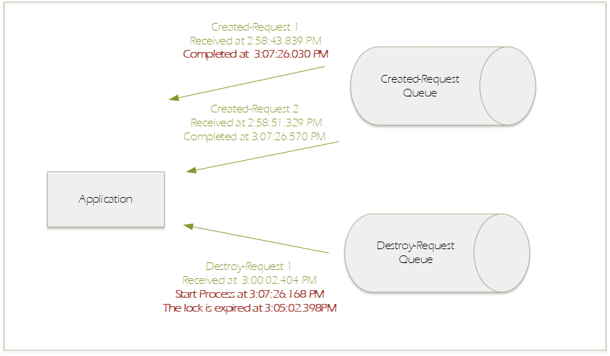
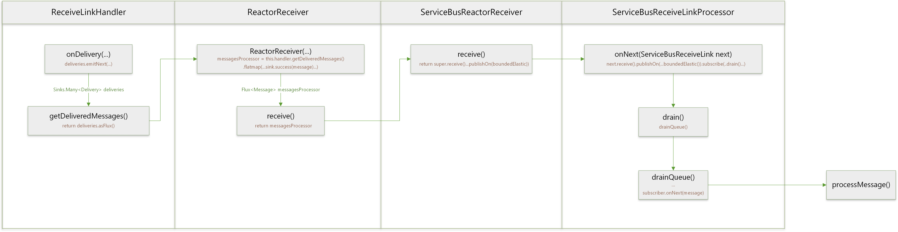

# Message stuck before processing

https://github.com/Azure/azure-sdk-for-java/issues/30609

Possible related:
https://github.com/Azure/azure-sdk-for-java/issues/30483


### Background

There are two receiver clients to receive two different queues under same namespace. Application are runs on two instances.

The data volumn is low, only 3 message received in 5 minutes. And may be 5 - 10 message in a hour.

One message got lock expired error when it pass to process message function.

### Log Analysis



The message was received but before being passed to the processMessage, it stuck until another message completed and released the thread. 

### Code Analysis

The call graph for client after receive a message: 



As we can see "There are no credits to add." log just after received message. So the message should hang on `sink(message)` or `publishOn(Schedulers.boundedElastic())`.

### Posible Reason

Consider that the received message wait until another message completed and the thread boundedElastic-2 released, and publishOn the same boundedElastic-2.

I suspect this issue is the thread pool size is not enough. (I don't know if it is caused by the reactor backpressure of sink). 

### Reproduce

Project: https://github.com/liukun-msft/spring-cloud-azure-stream-binder-servicebus-sample


Way 1. Use debug mode, set breakpoint at `sink.success(message)` inside `ReactorReceiver.java`, repro the same error logs.

Way 2. Add VM option "-Dreactor.schedulers.defaultBoundedElasticSize=3" and send 2 messages to one queue and 1 messages to another queue repro the same error logs.


### Detailed code

```Java
//ReceiveLinkHander.java
@Override
public void onDelivery(Event event) {
    ...
    final Delivery delivery = event.getDelivery();
    final Receiver link = (Receiver) delivery.getLink();

    final boolean wasSettled = delivery.isSettled();
    if (!delivery.isPartial()) {
        ...
        } else {
            if (link.getLocalState() == EndpointState.CLOSED) {
                delivery.disposition(new Modified());
                delivery.settle();
            } else {
                queuedDeliveries.add(delivery);
                deliveries.emitNext(delivery, (signalType, emitResult) -> {
                    ...
                });
            }
        }
    }

    if (link != null) {
        final ErrorCondition condition = link.getRemoteCondition();
        addErrorCondition(logger.atVerbose(), condition)
            .addKeyValue(ENTITY_PATH_KEY, entityPath)
            .addKeyValue(LINK_NAME_KEY, linkName)
            .addKeyValue("updatedLinkCredit", link.getCredit())
            .addKeyValue("remoteCredit", link.getRemoteCredit())
            .addKeyValue("delivery.isPartial", delivery.isPartial())
            .addKeyValue("delivery.isSettled", wasSettled)
            .log("onDelivery.");
    }
    ...
}
```

```Java
//ReceiveLinkHander.java
public Flux<Delivery> getDeliveredMessages() {
    return deliveries.asFlux().doOnNext(queuedDeliveries::remove);
}
```

```Java
//ReactorReceiver.java
protected ReactorReceiver(...){
    ...
    this.messagesProcessor = this.handler.getDeliveredMessages()
        .flatMap(delivery -> {
            return Mono.create(sink -> {
                ...
                    this.dispatcher.invoke(() -> {
                        ....
                        } else {
                            logger.atVerbose()
                                .addKeyValue("credits", credits)
                                .log("There are no credits to add.");
                        }
                        metricsProvider.recordAddCredits(credits == null ? 0 : credits);
                        sink.success(message);
                    });
                } 
     ...
}
```


```Java
//ReactorReceiver.java
public Flux<Message> receive() {
    return messagesProcessor;
}
```

```Java
//ServiceBusReactorReceiver.java
@Override
public Flux<Message> receive() {
    // Remove empty update disposition messages. The deliveries themselves are ACKs with no message.
    return super.receive()
        .filter(message -> message != EMPTY_MESSAGE)
        .publishOn(Schedulers.boundedElastic());
}
```

```Java
//ServiceBusReceiveLinkProcessor.java
public void onNext(ServiceBusReceiveLink next) {
...
    next.receive().publishOn(Schedulers.boundedElastic()).subscribe(
        message -> {
            ...
            drain();
            ...
        }),
```

```Java
//ServiceBusReceiveLinkProcessor.java
private void drain() {
    if (wip.getAndIncrement() != 0) {
        return;
    }

    int missed = 1;
    while (missed != 0) {
        drainQueue();
        ...
    }
}

private void drainQueue() {
    final CoreSubscriber<? super Message> subscriber = downstream.get();
    ...

            try {
                subscriber.onNext(message);
    ...
            numberEmitted++;
            isEmpty = messageQueue.isEmpty();
        }

        if (REQUESTED.get(this) != Long.MAX_VALUE) {
            numberRequested = REQUESTED.addAndGet(this, -numberEmitted);
        }
    }
}
```


