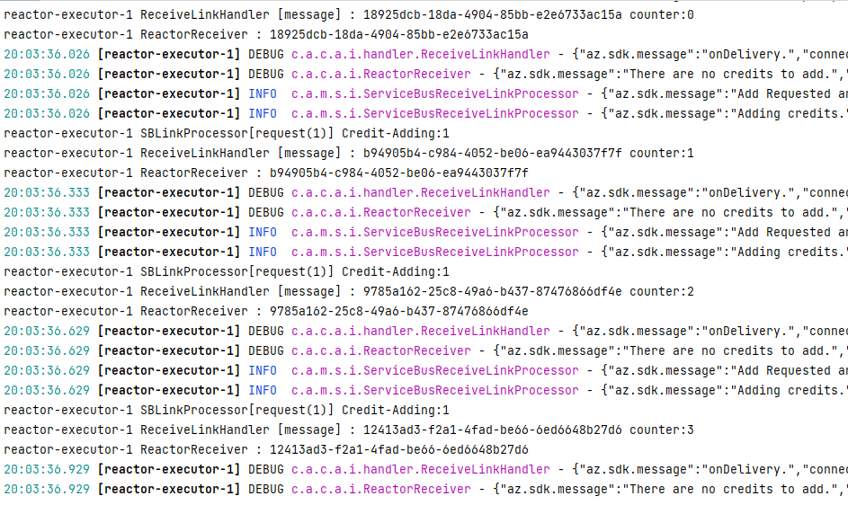
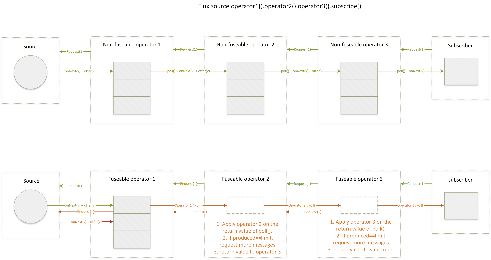
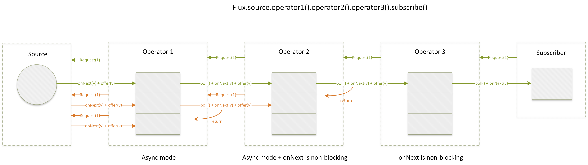

# Service Bus Processor internally prefetch more messages 

## Background

Issue: https://github.com/Azure/azure-sdk-for-java/issues/30530

```Java
ServiceBusProcessorClient processorClient = new ServiceBusClientBuilder()
        .connectionString(CONNECTION_STRING)
        .processor()
        ...
        .prefetch(0)
        .maxConcurrentCalls(2)
        .disableAutoComplete()
        .buildProcessorClient();
```

Receive 4 messages (prefetch 2 more messages) :




## Reactor Analysis

**Parallel Test**

 https://github.com/liukun-msft/reactor-core-test/blob/main/src/main/java/org/example/sinks/ParallelTest.java


**Funsion vs. non-Fusion**

Internally prefetch 1 more messages (One request).





Some operators like `publishOn()`, `limitRate()` can be fused if the upstream also supported. The operator will prefetch from upstream when downstream `poll()` from the fuseable queue.

**Async drain()**


Internally prefetch 2 more messages (Two requests).



Some operators like `parallel()`, `publishOn()`, `limitRate()` have async drain() function. The operator will prefetch from upstream after its `onNext()` return.


**Possible Solution**

- Replace `parallel()` by `flatMap(...,concurrency)`
- Customized Reactor Operator 

