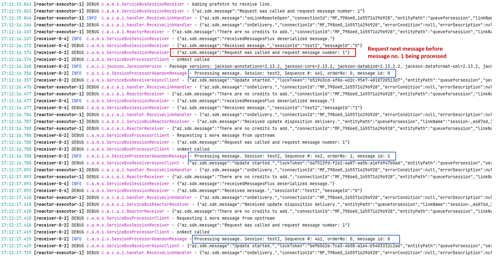

## [Service Bus] Abandon message may disrupt the ordered processing of session based message 

**Issue link**: https://github.com/Azure/azure-sdk-for-java/issues/24064.

### Description

When use `SessionProcessorClient` to receive messages, say we try to receive message #1 and #2. If we abondon message #1, the next message is to be processed is message #2, not message #1. We can receive and process message #1 only after message #2 has been processed.   

The issue is found in `SessionProcessorClient` and not in `SessionReceiverClient` and `ProcessorClient`.

### Log Analysis

See repro code snippet in [issue#24064](https://github.com/Azure/azure-sdk-for-java/issues/24064) 

Add some customized logs and run with the latest sevice bus version (7.10.0-beta.1):



From the log, we can see that when `SessionProcessor` receives the message #0, it immediately requests the next message #1 before message #0 fully processed. So actually we request 2 messages at first time. Therefore, if mesasge #0 is abandoned, we directly process message #1 as next message. After message #1 is processed, we then request abandoned message #0 again.

**The question becomes why we prefetch 2 messages? Although we use `publishOn(scheduler, prefetch = 1)` to receive message.**

### Code Analysis

For `SessionProcessor`, the `receiveClient` calls `ServiceBusSessionManager#receive()` to return a `receiveFlux` and uses `receiveFlux` to fetch messages. 

If `receiveClient` is a rolling receiver, `receiceFlux` will be construct by `Flux#merge`, which use `processor` to publish messages from different sessions. 

```Java
//ServiceBusSessionManager
Flux<ServiceBusMessageContext> receive() {
    ...
    receiveFlux = Flux.merge(processor, receiverOptions.getMaxConcurrentSessions());
    ...
    return receiveFlux;
}
```
 
 The `processor` will emit `Flux<ServiceBusMessageContext>` to receive messages when session and receive link is active. This is created by `ServiceBusSessionManager#getSession()` function.

```Java
private Flux<ServiceBusMessageContext> getSession(...){
    return getActiveLink().flatMap(link -> link.getSessionId()
        .map(...return new ServiceBusSessionReceiver(...)))
        .flatMapMany(sessionReceiver -> sessionReceiver.receive()...)
        .publishOn(scheduler, 1); //prefetch = 1
}
```
Here we set prefetch of publishOn is 1, so we only request 1 message every time try to receive.

The `sessionReceiver.receive()` will return `receivedMessageFlux`, which defines publish source is from `receiveLink.receive()` and some actions like `doOnsubscribe()`,, `doOnRequest()`, `map()` tp deserilaize message and `onErrorResume()`. 

```Java
//ServiceBusSessionReceiver
final Flux<ServiceBusMessageContext> receivedMessagesFlux = receiveLink
            .receive()
            .publishOn(scheduler)
            .doOnSubscribe(subscription -> {
              ...
            })
            .doOnRequest(request -> {  // request is of type long.
              ...
            })
            .takeUntilOther(cancelReceiveProcessor)
            .map(message -> {
              ...
            })
            .onErrorResume(error -> {
              ...
            })
            .doOnNext(context -> {
                ...
            });
```

After going though the code, the logic looks good and we prefetch only 1 message at a time. The reason may comes from reactor-core or we may wrongly use some `Flux` methods. To verify that, we can simplify the issue by only write the reactor code to represent session receiving prossess. See [Simplify receive logic](./working-notes.md#simplify-receive-logic).

### Simplify receive logic

I write code which only using reactor to repro the issue. This can help to debug and fix more easily:

```Java
@Test
public void testPublishOnWithMerge() throws InterruptedException {
    Scheduler scheduler = Schedulers.newBoundedElastic(5, 5, "receiver-");
    Sinks.Many<String> messageSinks = Sinks.many().replay().all();
    //Represent for receivedFlux in ServiceBusSessionReceiver
    Flux<String> receivedMessagesFlux = messageSinks.asFlux()
            .doOnSubscribe(subscription -> {
                logger.info("receivedMessagesFlux - doOnSubscribe called");
            })
            .doOnRequest(request -> {
                logger.info("receivedMessagesFlux - doOnRequest called, request number: " + request);
            })
            .doOnNext(message -> {
                logger.info("receivedMessagesFlux - Received message : " + message);
            })
            .log();

   //Represent for getSession in ServiceBusSessionManager
    Flux<String> sessionFlux = Mono.defer(() -> Mono.just("Active link 1 "))
            .map(link -> link + "On session")
            .flatMapMany(link -> receivedMessagesFlux)
            .publishOn(scheduler,1);

    //Represent for processor in ServiceBusSessionManager
    Sinks.Many<Flux<String>> processor = Sinks.many().replay().all();
    processor.tryEmitNext(sessionFlux);
    Flux<String> messageFlux = Flux.merge(processor.asFlux(),1);

    //Represent for messageFlux in ServiceBusReceiveAyncClient
    messageFlux.subscribe(subscriber);

    logger.info("-------------- emit messages ------------");
    messageSinks.emitNext("First Data", FAIL_FAST);
    messageSinks.emitNext("Second Data", FAIL_FAST);
    messageSinks.emitNext("Third Data", FAIL_FAST);


    TimeUnit.SECONDS.sleep(5);
}
```

### Root Cause Analysis

After debugging and testing, the issue occur when we use `Flux#publishOn` in combination with `Flux#merge`. The reactor will create a class `FluxPublishOn` to wrap `Flux#merge` as `Subscriber` to `Flux#publishOn`. And when recevived messages, the `FluxPublishOn` will call its `poll()` method to get message from queue and then pass to the downstream `onNext()` method.

```Java
//FluxPublishOn.class
public T poll() {
    T v = queue.poll();
    if (v != null && sourceMode != SYNC) {
        long p = produced + 1;
        if (p == limit) {
            produced = 0;
            s.request(p);
        }
        else {
            produced = p;
        }
    }
    return v;
}
```
For the implementation, we can see there is `p == limit` check block. When `p` reaches the `limit`, the `FluxPublishOn` will re-request `p` messages . 

Now we can explain why we receive 2 messages (#0 and #1) before processing message #0:

**When we received the first message (#0), the `p` becomes 1 and `limit` is 1 (prefetch == 1), so `s` (subscription) will reuqest one more message (#1) before passing the first message (#0) to downsteam `onNext()` to consume.**

This is an internal implementation of `FluxPublishOn`, that adds behavior that we don't expect. I still need to understand why they implement the `poll()` function in this way.

### Solutions

Some walkaround can solve the issue, but these need to be tested to see if they bring new impact:

1. Add `map(message -> message)` after `publishOn(scheduler, 1)

2. Move `publishOn(scheduler, 1)` to `ServiceBusSessionReceiver` 

Both of these methods will not save `PublishOnSubscriber` as queue in `FluxFlatMap`, so it will not call  `PublishOnSubscriber#poll()` function to re-request `p` messages.

**Current Solution:**

Remove `publishOn(scheduler, 1)`, add `limitRate(1)` after `onRequest()` function

### Follow up issue when `maxConcurrentSessions > 1`
 
When session concurrency > 1, `Flux.merge()` is going to merge all session receivers, and it have the similar issue. Because when one receiver has successfully pass the message to downstream to consume, at same time, another session receiver may emit failure, and `Flux.merge` will put that message into the queue and request next message immediately. Hence, client requests next message before current message consumed, so that if we abandon message, the next coming message order is not correct.


Another known issue is when use `Flux.merge()`,  client only consume one session message during a time and if no message received, it move to receive another session. So messages from different session are delivered serialized:

https://github.com/Azure/azure-sdk-for-java/issues/27336
https://github.com/Azure/azure-sdk-for-java/issues/24047


 Although we can set max current call > 1 to process messages in parallel. But if we `Flux.merge()` + `parrellel()`, it doesn't mean that we process each session in parrallel. It may processes one session message in parrallel and at it finished, then process another session, which is also mentioned in: https://github.com/Azure/azure-sdk-for-java/issues/24487

**Current thinking**

Don't use `Flux.merge()`, create subscriber for each session and runs on different threads. So each session works independently. 

1. `ServiceBusSessionManager#receive()` return `Flux<Flux<ServiceBusMessageContext>>`, adding new API in `ServiceBusAysncReceiver` to return `Flux<Flux<~>>` and create subscriber when session manager emit new .
2. If `maxConcurrentSession = n` , In processor, we call a new API `ServiceBusSessionManager#receiveFromNextSession()` n times to get n `Flux<ServiceBusMessageContext>` responses. For each reponse, we create a new subscriber to subscribe for each new session.

```Java
//ServiceBusSessionManager
Flux<ServiceBusMessageContext> receiveFromNextSession() {
    Scheduler scheduler = availableSchedulers.poll();
    if (!receiverOptions.isRollingSessionReceiver()) {
        receiveFlux = getSession(scheduler, false);
    } else {
        receiveFlux = getSession(scheduler, true);
    }
    return receiveFlux;
}
```

But here is base on the consumption of `maxConcurrentSessions` = `maxConcurrentCalls`. We don't set `maxConcurrentCalls` number and leverage session thread to consume message.

Questions:

But how to combine `maxConcurrentSessions` with `maxConcurrentCalls` base on current thinking?


Different behaviors when we abandon message.