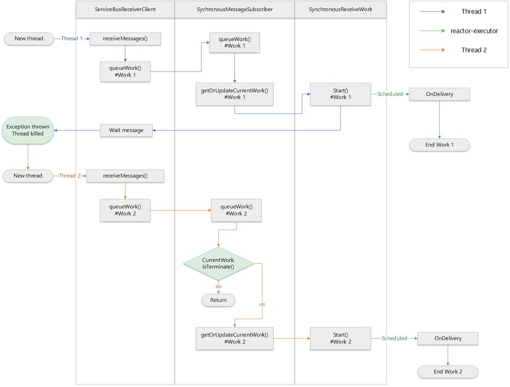

# Sevice Bus Synchronous Receiver client stops receiving

## Issue 

After kills the executing thread when it is in the middle of iterating the received messages from 
```Java
IterableStream<ServiceBusReceivedMessage> com.azure.messaging.servicebus.ServiceBusReceiverClient.receiveMessages(int maxMessages). 
```

When brings up a new thread to receive messages, the iterator doesn't retrieve any new messages.


### Reproduce

Receiver go stuck sometimes when

1. Empty the service bus queue
2. Start receiver and wait it have below logs:
    ```
    14:54:29.466 [Thread-21] DEBUG c.a.m.s.SynchronousMessageSubscriber - workId[20] numberOfEvents[10] timeout[PT4M5.6S] First work in queue. Requesting upstream if needed.
    14:54:29.467 [Thread-21] DEBUG c.a.m.s.SynchronousMessageSubscriber - workId[20] numberOfEvents[10] Current work updated.
    14:54:29.467 [Thread-21] DEBUG c.a.m.s.SynchronousMessageSubscriber - Requesting messages from upstream. currentRequested[10] numberOfMessages[10] difference[0]
    ```
3. Start sender 
4. Throw an exception in receiver thread and bring up a new thread
5. Recevier will not receive new messages

Use code:

 https://github.com/conniey/servicebus-demo/blob/main/src/main/java/org/example/SyncReceiveThrows.java  

### Logs

**Correct logs**:

```
19:03:12.841 [reactor-executor-2] DEBUG c.a.m.s.i.ServiceBusReactorReceiver - {"az.sdk.message":"Received update disposition delivery.","entityPath":"testqueue","linkName":"testqueue_9cba24_1646737143731","lockToken":"ff1fbc0c-59c5-47c7-95e3-3bfc62c590ba","deliveryState":"Accepted{}"}
19:03:12.841 [reactor-executor-2] DEBUG c.a.m.s.ServiceBusReceiverAsyncClient - {"az.sdk.message":"Update completed.","lockToken":"ff1fbc0c-59c5-47c7-95e3-3bfc62c590ba","entityPath":"testqueue","dispositionStatus":"COMPLETED"}
round[8] #[45] messageId[31] 
---- CREATING 9 ----
19:03:12.843 [Thread-10] DEBUG c.a.m.s.SynchronousMessageSubscriber - {"az.sdk.message":"First work in queue. Requesting upstream if needed.","workId":9,"numberOfEvents":10,"timeout":"PT4M5.6S"}
19:03:12.843 [Thread-10] DEBUG c.a.m.s.SynchronousMessageSubscriber - {"az.sdk.message":"Current work updated.","workId":9,"numberOfEvents":10}
19:03:12.843 [Thread-10] DEBUG c.a.m.s.SynchronousMessageSubscriber - {"az.sdk.message":"Requesting messages from upstream.","requested":2,"numberOfMessages":10,"difference":8}
19:03:12.843 [Thread-10] INFO  c.a.m.s.i.ServiceBusReceiveLinkProcessor - {"az.sdk.message":"Adding credits.","prefetch":0,"requested":10,"linkCredits":2,"expectedTotalCredit":10,"queuedMessages":0,"creditsToAdd":8,"messageQueueSize":0}
Exception in thread "Thread-9" java.lang.IllegalStateException: Test error occurs. index: 45
	at com.azure.servicebus.scenarios.SyncReceiveThrows.lambda$createNewThread$0(SyncReceiveThrows.java:53)
	at java.base/java.lang.Thread.run(Thread.java:834)
19:03:25.871 [reactor-executor-2] DEBUG c.a.c.a.i.handler.ReceiveLinkHandler - {"az.sdk.message":"onDelivery.","connectionId":"MF_989ca3_1646737143709","errorCondition":null,"errorDescription":null,"entityPath":"testqueue","linkName":"testqueue_9cba24_1646737143731","updatedLinkCredit":10,"remoteCredit":7,"delivery.isPartial":false,"delivery.isSettled":false}
19:03:25.871 [reactor-executor-2] DEBUG c.a.c.a.i.handler.ReceiveLinkHandler - {"az.sdk.message":"onDelivery.","connectionId":"MF_989ca3_1646737143709","errorCondition":null,"errorDescription":null,"entityPath":"testqueue","linkName":"testqueue_9cba24_1646737143731","updatedLinkCredit":10,"remoteCredit":7,"delivery.isPartial":false,"delivery.isSettled":false}
19:03:25.871 [reactor-executor-2] DEBUG c.a.c.a.i.handler.ReceiveLinkHandler - {"az.sdk.message":"onDelivery.","connectionId":"MF_989ca3_1646737143709","errorCondition":null,"errorDescription":null,"entityPath":"testqueue","linkName":"testqueue_9cba24_1646737143731","updatedLinkCredit":10,"remoteCredit":7,"delivery.isPartial":false,"delivery.isSettled":false}
round[9] #[46] messageId[36] 
```

Exception have no impact.

**Error logs**:

```
13:56:47.118 [reactor-executor-1] DEBUG c.a.c.a.i.handler.ReceiveLinkHandler - {"az.sdk.message":"onDelivery.","connectionId":"MF_5577fe_1646718906637","errorCondition":null,"errorDescription":null,"entityPath":"testqueue","linkName":"testqueue_7552d7_1646718906715","updatedLinkCredit":6,"remoteCredit":6,"delivery.isPartial":false,"delivery.isSettled":false}
13:56:47.118 [reactor-executor-1] DEBUG c.a.m.s.i.ServiceBusReactorReceiver - entityPath[testqueue], linkName[testqueue_7552d7_1646718906715], deliveryTag[60a8a670-214b-4f8c-a1eb-06db47d67944], state[Accepted{}] Received update disposition delivery.
13:56:47.118 [reactor-executor-1] DEBUG c.a.m.s.ServiceBusReceiverAsyncClient - testqueue: Update completed. Disposition: COMPLETED. Lock: 60a8a670-214b-4f8c-a1eb-06db47d67944.
13:56:47.124 [reactor-executor-1] DEBUG c.a.c.a.i.handler.ReceiveLinkHandler - {"az.sdk.message":"onDelivery.","connectionId":"MF_5577fe_1646718906637","errorCondition":null,"errorDescription":null,"entityPath":"testqueue","linkName":"testqueue_7552d7_1646718906715","updatedLinkCredit":6,"remoteCredit":5,"delivery.isPartial":false,"delivery.isSettled":false}
round[1] #[15] messageId[2] 
---- CREATING 2 ----
13:56:47.124 [Thread-3] DEBUG c.a.m.s.SynchronousMessageSubscriber - workId[2] numberOfEvents[10] timeout[PT4M5.6S] First work in queue. Requesting upstream if needed.
Exception in thread "Thread-2" java.lang.IllegalStateException: Test error occurs. index: 15
	at com.azure.servicebus.scenarios.SyncReceiveThrows.lambda$createNewThread$0(SyncReceiveThrows.java:53)
	at java.base/java.lang.Thread.run(Thread.java:834)
13:56:47.551 [reactor-executor-1] DEBUG c.a.c.a.i.handler.ReceiveLinkHandler - {"az.sdk.message":"onDelivery.","connectionId":"MF_5577fe_1646718906637","errorCondition":null,"errorDescription":null,"entityPath":"testqueue","linkName":"testqueue_7552d7_1646718906715","updatedLinkCredit":5,"remoteCredit":4,"delivery.isPartial":false,"delivery.isSettled":false}
13:56:47.978 [reactor-executor-1] DEBUG c.a.c.a.i.handler.ReceiveLinkHandler - {"az.sdk.message":"onDelivery.","connectionId":"MF_5577fe_1646718906637","errorCondition":null,"errorDescription":null,"entityPath":"testqueue","linkName":"testqueue_7552d7_1646718906715","updatedLinkCredit":4,"remoteCredit":3,"delivery.isPartial":false,"delivery.isSettled":false}
13:56:48.398 [reactor-executor-1] DEBUG c.a.c.a.i.handler.ReceiveLinkHandler - {"az.sdk.message":"onDelivery.","connectionId":"MF_5577fe_1646718906637","errorCondition":null,"errorDescription":null,"entityPath":"testqueue","linkName":"testqueue_7552d7_1646718906715","updatedLinkCredit":3,"remoteCredit":2,"delivery.isPartial":false,"delivery.isSettled":false}
13:56:48.819 [reactor-executor-1] DEBUG c.a.c.a.i.handler.ReceiveLinkHandler - {"az.sdk.message":"onDelivery.","connectionId":"MF_5577fe_1646718906637","errorCondition":null,"errorDescription":null,"entityPath":"testqueue","linkName":"testqueue_7552d7_1646718906715","updatedLinkCredit":2,"remoteCredit":1,"delivery.isPartial":false,"delivery.isSettled":false}
13:56:49.245 [reactor-executor-1] DEBUG c.a.c.a.i.handler.ReceiveLinkHandler - {"az.sdk.message":"onDelivery.","connectionId":"MF_5577fe_1646718906637","errorCondition":null,"errorDescription":null,"entityPath":"testqueue","linkName":"testqueue_7552d7_1646718906715","updatedLinkCredit":1,"remoteCredit":0,"delivery.isPartial":false,"delivery.isSettled":false}
13:56:49.245 [reactor-executor-1] DEBUG c.a.c.a.i.ReactorReceiver - {"az.sdk.message":"There are no credits to add.","connectionId":"MF_5577fe_1646718906637","linkName":"testqueue_7552d7_1646718906715","credits":"0"}
//Stuck here
//Add extra log in complete()
13:56:49.245 [boundedElastic-2] INFO  c.a.m.s.SynchronousReceiveWork - {"az.sdk.message":"Complete Work!","workId":1}
```

Conpare with correct logs, it doesn't have message: **SynchronousMessageSubscriber: Current work updated**

So the new work is not updated. That cause the receiver stuck and not receive anything.

### Anaylsis

Rough flow



**Reanson**

When thread was kill, currentWork(#Work 1) may not fully terminated because it running on other scheduled thread. Then when new work(#Work 2) comes in, Base on currently sdk logic it will directly returned and not update the new work.

**Mitigate**

After Exception thrown, wait few seconds before bring up new thread.


**Addition Information**
no issue in version 7.4.2, only from 7.5.1.

related changes: https://github.com/Azure/azure-sdk-for-java/pull/25771/

**TODO**

Confirm the root cause and fix it.